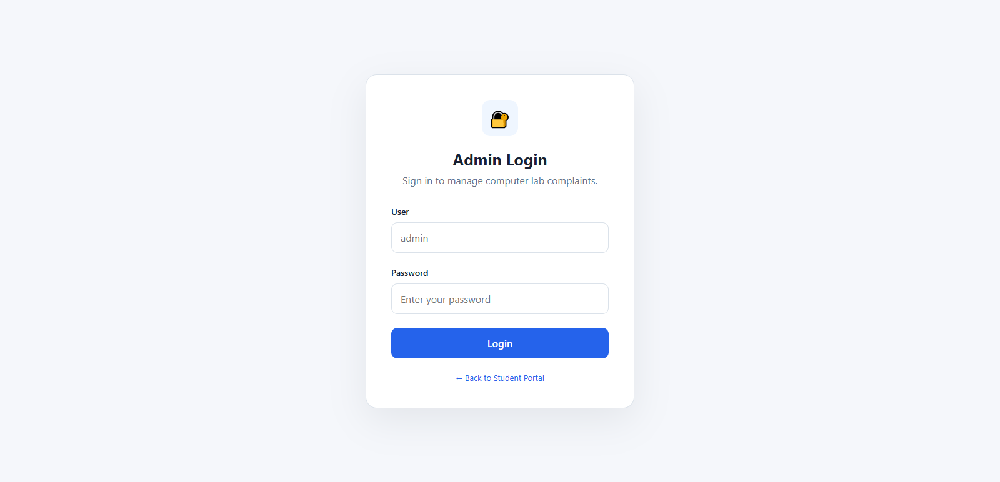
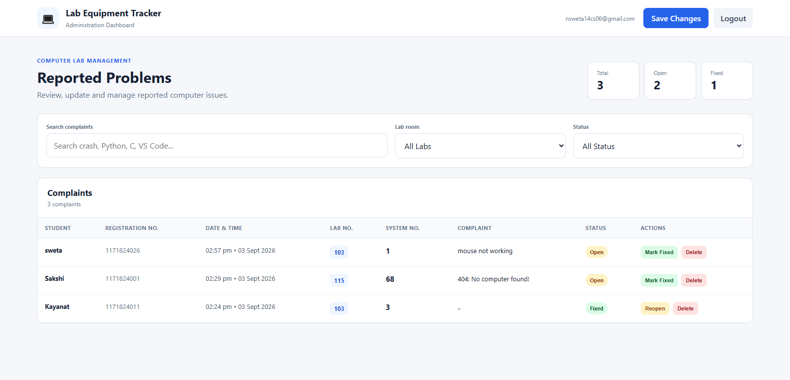

# 💻 LabSync — Lab Equipment Tracker

> **A simple, fast and secure way to report, manage and track computer-lab equipment problems.**

LabSync is a lightweight web-based **Lab Equipment Tracker** designed for educational computer labs. Students can quickly report problems with a particular lab system, while authorized administrators can review, filter, update and delete complaints from a dedicated dashboard.

Built with **HTML, CSS, JavaScript and Supabase**, LabSync keeps the interface clean for students while giving lab administrators the tools they need to manage reported issues efficiently.

---

## 🌍 Live Preview

https://priyam-26.github.io/LabSync/

---

## ✨ What LabSync Does

### 🎓 Student Portal

Students can report an equipment/software problem in just a few steps:

- Enter their **name**
- Enter their **board roll number**
- Select the **lab room**
- Enter the affected **system number**
- Describe the problem in a maximum of **100 words**
- Submit the complaint directly to the database
- Receive an immediate confirmation after successful submission

Currently supported lab rooms:

- 🖥️ Lab **103**
- 🖥️ Lab **115**
- 🖥️ Lab **121**

Students do **not** need to create an account to submit a complaint.

### 🛠️ Admin Dashboard

Authorized lab administrators get a dedicated dashboard where they can:

- 🔐 Sign in securely through Supabase Authentication
- 📊 View complaint statistics
- 🔎 Search complaints
- 🧪 Filter complaints by lab
- 🚦 Filter complaints by status
- ✅ Mark complaints as **FIXED**
- 🔄 Reopen complaints when required
- 🗑️ Delete complaints
- 💾 Save multiple changes together
- 🚪 Log out securely

The dashboard also keeps track of unsaved changes and asks for confirmation before potentially losing them.

---

## 🧩 Main Features

| Feature | Description |
|---|---|
| 📝 Complaint submission | Students can report a problem without logging in |
| 👤 Student identification | Stores student name and board roll number |
| 🏫 Lab selection | Supports Labs 103, 115 and 121 |
| 💻 System tracking | Records the affected computer/system number |
| ✍️ 100-word limit | Prevents unnecessarily long complaint descriptions |
| 🔐 Admin authentication | Uses Supabase Auth for administrator login |
| 📊 Dashboard statistics | Shows total, open and fixed complaints |
| 🔎 Search | Quickly find complaints using keywords |
| 🧪 Lab filtering | View complaints from a specific lab |
| 🚦 Status filtering | Separate OPEN and FIXED complaints |
| ✏️ Status management | Admins can update complaint status |
| 🗑️ Complaint deletion | Admins can remove unwanted records |
| 🛡️ Row Level Security | Database access is restricted with Supabase RLS |
| 🧹 Automatic cleanup | Fixed complaints older than 7 days are automatically removed |

---

## 🏗️ Project Structure

```text
LabSync-main/
│
├── 📄 index.html                 # Student complaint portal
├── 📄 admin.html                 # Admin login & dashboard
├── 🖼️ favicon.png               # Website favicon
│
├── 📁 css/
│   ├── style.css                 # Student portal styling
│   └── admin.css                 # Admin dashboard styling
│
├── 📁 js/
│   ├── config.js                 # Supabase configuration
│   ├── student.js                # Student portal logic
│   └── admin.js                  # Admin dashboard logic
│
└── 📁 supabase/
    └── database.sql              # Database schema, RLS & cleanup job
```

---

## ⚙️ Tech Stack

### Frontend
- **HTML5** — page structure
- **CSS3** — responsive styling and layout
- **Vanilla JavaScript** — application logic and interactions

### Backend / Database
- **Supabase** — PostgreSQL database and authentication
- **Supabase Auth** — administrator authentication
- **Row Level Security (RLS)** — database access control
- **pg_cron** — automatic cleanup of old fixed complaints

### Architecture

LabSync is intentionally lightweight:

```text
Student
   │
   ▼
Student Portal
(index.html + student.js)
   │
   │ Submit complaint
   ▼
Supabase
   │
   ├── PostgreSQL → complaints
   │
   └── RLS policies
          ▲
          │
Admin Dashboard
(admin.html + admin.js)
   │
   ├── Search
   ├── Filter
   ├── Update
   └── Delete
```

---

## 🚀 Getting Started

### 1. Download / Clone the Project

Clone the repository or download the project files.

```bash
git clone <https://github.com/priyam-26/LabSync.git>
cd LabSync-main
```

Because LabSync is a static frontend, there is no Node.js server or build process required.

---

### 2. Create a Supabase Project

Create a new project in **Supabase**.

Once the project is ready, open the **SQL Editor**.

---

### 3. Set Up the Database

Run:

```text
supabase/database.sql
```

This creates:

- `complaints` table
- `admins` table
- Required indexes
- Row Level Security policies
- Automatic cleanup for fixed complaints older than 7 days

> ⚠️ The cleanup section uses `pg_cron`. Make sure the extension is available and enabled for your Supabase project before relying on the scheduled cleanup job.

---

### 4. Configure Supabase

Open:

```text
js/config.js
```

and configure your Supabase project URL and anonymous key:

```javascript
const SUPABASE_URL = "YOUR_SUPABASE_URL";
const SUPABASE_ANON_KEY = "YOUR_SUPABASE_ANON_KEY";
```

The frontend uses the Supabase **anon/public key**. Database security should therefore be enforced through the RLS policies in `database.sql`.

> 🔒 Never place a Supabase **service-role key** or other secret backend credentials in this frontend project.

---

### 5. Create an Admin Account

In Supabase:

1. Open **Authentication**
2. Create an administrator user
3. Copy the user's UUID
4. Insert that UUID into the `admins` table

Example:

```sql
insert into public.admins (user_id)
values ('YOUR_AUTH_USER_UUID');
```

Only users whose UUID exists in `public.admins` are allowed to read, update or delete complaints.

---

### 6. Run the Project

Since this is a static website, you can open the HTML files directly, but using a local development server is recommended.

For example, with Python:

```bash
python -m http.server 8000
```

Then open:

```text
http://localhost:8000
```

Student portal:

```text
http://localhost:8000/index.html
```

Admin dashboard:

```text
http://localhost:8000/admin.html
```

---

## 🔐 Security Model

LabSync uses **Supabase Row Level Security (RLS)** to separate student and administrator access.

### Students

Students are unauthenticated users and can:

```text
INSERT → complaints
```

They cannot directly:

```text
SELECT → complaints
UPDATE → complaints
DELETE → complaints
```

### Administrators

Authenticated users must also exist in the `admins` table.

Authorized admins can:

```text
SELECT → complaints
UPDATE → complaints
DELETE → complaints
```

This means the frontend does not rely on simply hiding admin functionality — the database itself enforces access rules.

---

## 🧹 Automatic Complaint Cleanup

LabSync includes an automated database cleanup job.

When a complaint is marked:

```text
FIXED
```

its `fixed_at` timestamp is recorded.

Fixed complaints older than **7 days** are then automatically deleted by the scheduled PostgreSQL job.

This keeps the active complaint database small and focused on recent issues.

---

## 🔄 Complaint Lifecycle

A typical complaint moves through the following flow:

```text
📝 Student submits problem
          │
          ▼
      🔴 OPEN
          │
          ▼
🛠️ Admin works on the issue
          │
          ▼
     🟢 FIXED
          │
          ▼
🧹 Automatically removed
   after 7 days
```

---

## 🎨 Design Goals

LabSync focuses on a few simple principles:

- **⚡ Fast** — minimal dependencies and no unnecessary build system
- **🧼 Clean** — straightforward interface with focused workflows
- **📱 Responsive** — designed to remain usable across screen sizes
- **🎯 Practical** — built around an actual lab-management workflow
- **🔐 Secure** — database-level access control with RLS
- **🛠️ Maintainable** — separate HTML, CSS, JavaScript and SQL files

---

## 📸 Screenshots

Here’s a look at LabSync in action — from submitting a complaint to managing it through the administrator dashboard.

### 🎓 Student Dashboard

The student-facing dashboard provides a clean and straightforward interface for reporting lab equipment issues.


---

### 🔐 Admin Login

A dedicated login interface keeps the administrative dashboard accessible only to authorized users.



---

### 🛠️ Admin Dashboard

The admin dashboard provides an overview of reported issues along with search, filtering, status management and complaint controls.



---

## 🌐 Deployment

Because LabSync is a static frontend, it can be hosted on services such as:

- GitHub Pages
- Netlify
- Vercel
- Cloudflare Pages
- Any static web server

The Supabase project acts as the backend and database.

For production deployment, make sure:

1. Your Supabase URL and anon key are configured correctly.
2. RLS policies are enabled.
3. Only intended administrator accounts are added to `admins`.
4. No service-role or private Supabase keys are exposed in the frontend.
5. The database cleanup job is configured correctly.

---

## 🧪 Example Use Case

Imagine a student is working in **Lab 115** and discovers that **System 07** is unable to open VS Code.

Instead of manually informing a lab assistant:

```text
Name: Priyam
Registration No.: 117xxxxxxx
Lab Room No.: 115
System No.: 07
Problem: VS Code is not opening on this computer.
```

The complaint is submitted → stored in Supabase → appears on the admin dashboard → the administrator fixes the system → marks it **FIXED**.

Simple. 🎯

---

## 📌 Current Scope

LabSync currently focuses on **complaint reporting and administrative tracking**.

It does not currently include:

- Student accounts
- Email/SMS notifications
- File/image attachments
- Technician assignment
- Repair-cost tracking
- Detailed audit history
- Multi-institution support

These can be added later if the project grows.

---

## 💡 Possible Future Improvements

Some natural next steps could be:

- 🔔 Real-time admin notifications
- 📧 Email notifications when a complaint is fixed
- 📎 Screenshot/image attachments
- 👨‍🔧 Technician assignment
- 📈 Complaint analytics and trends
- 🕒 Estimated resolution time
- 🧾 Full complaint history
- 📱 Installable PWA support
- 🌙 Dark mode
- 🏫 Support for additional labs and departments

---

## 🤝 Contributing

Contributions and improvements are welcome.

A simple workflow:

```bash
git checkout -b feature/your-feature
```

Make your changes, test them locally, and submit a pull request.

When changing database behavior, remember to update:

```text
supabase/database.sql
```

along with the relevant frontend code.

---

## 👨‍💻 Project

**LabSync — Lab Equipment Tracker**

Built to make reporting lab equipment problems **faster, clearer and easier to manage.** 🚀

> **Report it. Track it. Fix it.** 💻

---

## 👨‍💻 Author

**Priyam Prabhat**<br>
Computer Science Student | Web Development | Cybersecurity

---

## ⭐

If you find this project nice, you can give it a ⭐ on GitHub!
